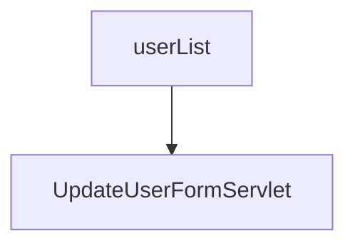

# 6장
 
서블릿과 jsp는 자바진영에서 동적인 웹 애플리케이션을 개발하는 표준이였으나 플레이 프레임워크와 같이 서블릿 표준을 따르지 않는 기술도 등장함.


첫 번째 오류
> Unknown loader jdk.internal.loader.ClassLoaders$AppClassLoader@251a69d7 class jdk.internal.loader.ClassLoaders$AppClassLoader
> 

```
Feb 03, 2023 9:13:12 PM org.apache.coyote.AbstractProtocol init
정보: Initializing ProtocolHandler ["http-nio-8080"]
Feb 03, 2023 9:13:12 PM org.apache.tomcat.util.net.NioSelectorPool getSharedSelector
정보: Using a shared selector for servlet write/read
Feb 03, 2023 9:13:12 PM org.apache.catalina.core.StandardService startInternal
정보: Starting service Tomcat
Feb 03, 2023 9:13:12 PM org.apache.catalina.core.StandardEngine startInternal
정보: Starting Servlet Engine: Apache Tomcat/8.0.15
Feb 03, 2023 9:13:12 PM org.apache.catalina.startup.ContextConfig getDefaultWebXmlFragment
정보: No global web.xml found
Feb 03, 2023 9:13:14 PM org.apache.coyote.AbstractProtocol start
정보: Starting ProtocolHandler ["http-nio-8080"]
```
자바 버전을 11버전으로 설정된 상태에서 해당 리플렉션이 정상적으로 동작하지 않았음. 그렇기에 자바 8버전으로 다운그레이드 한 경우 정상적으로 동작한것을 확인함.

하지만 11버전으로 진행하기로 한 만큼 해당 방법은 일단 보류함.


## 1단계 요구사항
- 회원가입을 완료하면 사용자 목록 화면을 볼 수 있으며 각 사용자 우측에 "개인 정보 수정" 버튼이 있다.
- `HINT`
  - 회원가입한 사용자 정보를 수정할 수 있는 수정 화면과 사용자가 수정한 값을 수정하는 기능을 나누어 개발해야 한다.
