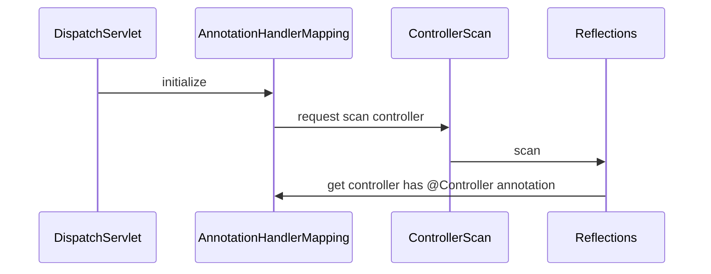

# 컨트롤러 매핑 과정

```mermaid

sequenceDiagram
    DispatchServlet ->> AnnotationHandlerMapping: initialize
    AnnotationHandlerMapping ->> ControllerScan: request scan controller
    ControllerScan ->> Reflections: scan
    Reflections ->> AnnotationHandlerMapping: get controller has @Controller annotation 
```