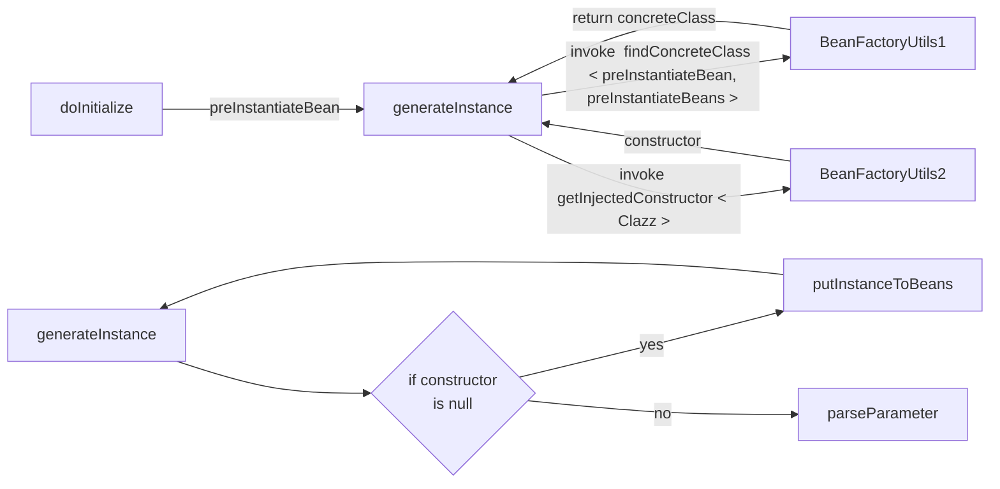

```mermaid
flowchart LR

doInitialize -- preInstantiateBean --> generateInstance -- invoke  findConcreteClass \n < preInstantiateBean, preInstantiateBeans > --> BeanFactoryUtils1 -- return concreteClass -->generateInstance

generateInstance -- invoke getInjectedConstructor < Clazz > --> BeanFactoryUtils2 -- constructor --> generateInstance

generateInstance1[generateInstance] --> case1{ if constructor \n is null} -- yes --> putInstanceToBeans --> generateInstance1
case1 -- no --> parseParameter

```