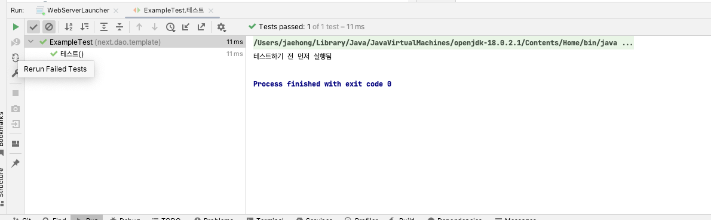

# 7장


### 의문 
1. 컴파일 타임 Exception을 사용해야하는 경우, 런타임 Exception을 사용해야하는 경우는 언제인가?


### 스터디 세미나 질문
1. 다른 사람의 예제코드를 보면 인터페이스의 구현체가 `-Impl`와 같은 형태를 종종 보게 되는데 왜 이렇게 작성한 것일까?


### 생각해본 부분
-[ ] 스크립트 작성
-[ ] SQL을 평문으로 작성하기
-[ ] JdbcTemplate Factory 패턴 적용하기
- [ ] 데이터베이스 테스트의 보일러 플레이트 제거하기
- [ ] `Postgresql` 적용하기
- [ ] 의존성 빌드 스크립트 작성하기
- [ ] `트랜잭션`적용하기


#### 스크립트 작성
먼저 지난주 리뷰에서 `jstl`의존성에 대한 이야기를 나눴다. `jsp`에서 `jstl`을 사용하기 위해서
`.jar`확장자를 가진 의존성을 설치해서 직접 복사 붙혀넣기 해줘야 한다.

하지만 `jsp`에서 사용해야 할 의존성이 늘어날 경우 매번 복사 붙혀넣기 해야 하며 그 외에도 라이브러리의 버전이 오르거나 다른 환경에서 라이브러리를 사용하는 경우가 발생한다면 동일한 작업을 해줘야 한다. 

그래서 다음과 같은 해결책을 제시하려고 합니다.
```groovy
task copyDependencies(type: Copy) {
    into file(project.projectDir.getAbsolutePath() + '/webapp/WEB-INF/lib')
    from configurations.default
}
```
해당 스크립트는 의존성을 복사해서 `/webapp/WEB-INF/lib`에 집어 넣어주는 스크립트입니다. 

#### sql을 평문으로 작성 
```java
public class UserDao {
    public void insert(User user) throws SQLException {
        final var jdbcTemplate = new JdbcTemplate();

        final var sql = "INSERT INTO USERS VALUES (?, ?, ?, ?)";
        jdbcTemplate.update(sql, (preparedStatement -> {
            preparedStatement.setString(1, user.getUserId());
            preparedStatement.setString(2, user.getPassword());
            preparedStatement.setString(3, user.getName());
            preparedStatement.setString(4, user.getEmail());
        }));
    }


    public User findByUserId(String userId) throws SQLException {
        final var jdbcTemplate = new JdbcTemplate();
        final var sql = "SELECT userId, password, name, email FROM USERS WHERE userid=?";

        return jdbcTemplate.queryForObject(sql, preparedStatement -> preparedStatement.setString(1, userId),
                resultSet -> User.of(
                        resultSet.getString("userId"),
                        resultSet.getString("password"),
                        resultSet.getString("name"),
                        resultSet.getString("email")
                )
        );
    }
}
```
현재 sql은 위와 같이 DAO에 그대로 노출되어 있다. 
`단일 책임 원칙`을 보면 객체가 한 가지 책임을 가져야 한다라고 하지만 실제 의미는 변하는 책임을 가진 것은 같이 모여 있어야 한다에 가깝다. 그렇기에 쿼리문 같은 경우 멀리 퍼져있는 것 보다 한 곳에 모여 있는 것이 응집도 면에서 더 좋을 것 같다.

```java

public class UserSql {

    public static final String CREATE = "INSERT INTO USERS VALUES (?, ?, ?, ?)";

    public static final String FIND_USER_BY_ID = "SELECT userId, password, name, email FROM USERS WHERE userid=?";

    public static final String FIND_ALL = "INSERT INTO USERS VALUES (?, ?, ?, ?)";

    public static final String UPDATE = "UPDATE USERS SET "
            + "password = ?,"
            + "name = ?,"
            + "email = ? "
            + "WHERE userid = ?";
}

```
다음과 같이 쿼리는 한 곳에 모아서 관리하는 것으로 공통된 것들을 한데 모았다.

#### Jdbc의 계속된 생성

현재 UserDao의 코드를 보면 계속해서 JdbcTemplate을 생성하는 것을 볼 수 있다.  

jdbcTemplate을 의존성을 주입받도록 변경하면 조금 더 깔끔한 코드를 작성할 수 있다.

하지만 여기서 한 가지 문제가 더 생긴다.

만약 `UserDao`를 호출하는 코드가 증가하면 증가할수록 계속해서 JdbcTemplate을 생성해줘야한다.
그래서 한가지 생각한 방법은 Factory를 이용해서 UserDao를 전달하도록 하는 것도 좋은 방법인것 같다. 


#### 데이터베이스 테스트 코드 중복 문제

데이터베이스와 관련된 데이터를 테스트하기 위해서 아래와 같은 데이터베이스 셋업이 필요로 합니다.
```java
public class AnyTest {
    @BeforeEach
    public void setup() {
        ResourceDatabasePopulator populator = new ResourceDatabasePopulator();
        populator.addScript(new ClassPathResource("jwp.sql"));
        DatabasePopulatorUtils.execute(populator, ConnectionManager.getDataSource());
    }
}
```
하지만 개인적으로 몇가지 의문점이 있는데 해당 코드를 다른 테스트코드에서도 동일하게 작성해야 한다는 점이다.

그렇게 되면 테스트할 `DAO`가 늘어날 경우 매번 해당 코드를 작성해줘야 하는 불편한점이 생긴다.

처음 생각한 방법은 상속을 이용한 방법이다.
```java
public class DAOTemplate {
    @BeforeEach
    void setup(){
        System.out.println("테스트하기 전 먼저 실행됨");
    }
}
```
다음과 같이 먼저 작성된 `DAOTemplate`을 `ExampleTest`클래스에 상속하고 실행시키면 다음과 같이 실행됩니다.
```java
public class ExampleTest extends DAOTemplate{

    @Test
    void 테스트(){

    }
}
```


이제 `DAOTemplate`을 상속시킴으로써 데이터베이스를 계속해서 초기화하는 코드에 대한 보일러 플레이트를 제거할 수 있다.

하지만 추가적인 기록을 생각해볼때 입력과 수정 삭제의 경우 `트랜잭션`을 필요로 한다.


### Postgresql 적용하기

개인적으로 인메모리 데이터베이스를 사용하는 것을 별로 좋아하지는 않는다. 실제 데이터베이스 환경과 다르기 때문에 서비스를 실행하는 연산과 네이티브 쿼리를 사용하는 기능을 별개로 구현하는 상황에서 어려움을 겪는 상황을 종종 겪었기 때문에 로컬 개발 혹은 간단한 환경에서도 실제 운영 디비와 동일한 환경을 만들어서 테스트하는 편이다. 

그렇기 때문에 이번 책에서는 `H2`인메모리 데이터베이스를 사용하지만 별도로 `Postgresql`을 사용해보려고 한다.
```java
public class ConnectionManager {
    private static final String DB_DRIVER = "org.h2.Driver";
    private static final String POSTGRESQL_DRIVER = "org.postgresql.Driver";
    private static final String POSTGRESQL_URL = "jdbc:postgresql://localhost:5432/postgres";
    private static final String DB_URL = "jdbc:h2:~/jwp-basic;AUTO_SERVER=TRUE";
    private static final String POSTGRESQL_USERNAME = "postgres";
    private static final String DB_USERNAME = "sa";
    private static final String POSTGRESQL_PASSWORD = "1234";
    private static final String DB_PW = "";

    public static DataSource getDataSource() {
        BasicDataSource ds = new BasicDataSource();
        /*ds.setDriverClassName(DB_DRIVER);
        ds.setUrl(DB_URL);
        ds.setUsername(DB_USERNAME);
        ds.setPassword(DB_PW);*/

        ds.setDriverClassName(POSTGRESQL_DRIVER);
        ds.setUrl(POSTGRESQL_URL);
        ds.setUsername(POSTGRESQL_USERNAME);
        ds.setPassword(POSTGRESQL_PASSWORD);
        return ds;
    }

    public static Connection getConnection() {
        try {
            return getDataSource().getConnection();
        } catch (SQLException e) {
            throw new IllegalStateException(e);
        }
    }
}
```
`Postgres`과 연동하는 방법은 `H2`와 동일한 방법을 사용한다. 하지만 여기서 문제점이 발생한다. 만약 한 서버에서 사용하는 데이터베이스 종류가 달라지는 경우
위와 같은 형태로 `URL`을 변경하고 아이디 비밀번호와 같은 고유값을 소스코드에서 직접 변경해줘야 한다. 그렇기에 별도로 다른 텍스트 파일을 읽어와서 값을 집어넣는 것이 괜찮은 방법으로 생각한다.


### 현재 템플릿에서 트랜잭션을 실행시킬 수 있을까?
실제로 JPA에서 모든 데이터를 처리하는 과정에서 기본적으로 트랜잭션 단위로 한다.


### 추가된 의문점

#### 커넥션 풀
개인적으로 데이터베이스에는 커넥션 풀이라는 개념이 존재한다. 
하나의 데이터베이스에서 연결될 수 있는 커넥션의 갯수는 정해져있으며 그 이상을 초과하는 연결을 할 수 없다.

#### 도커 오류
