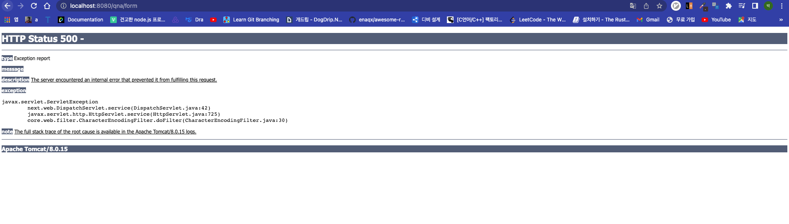
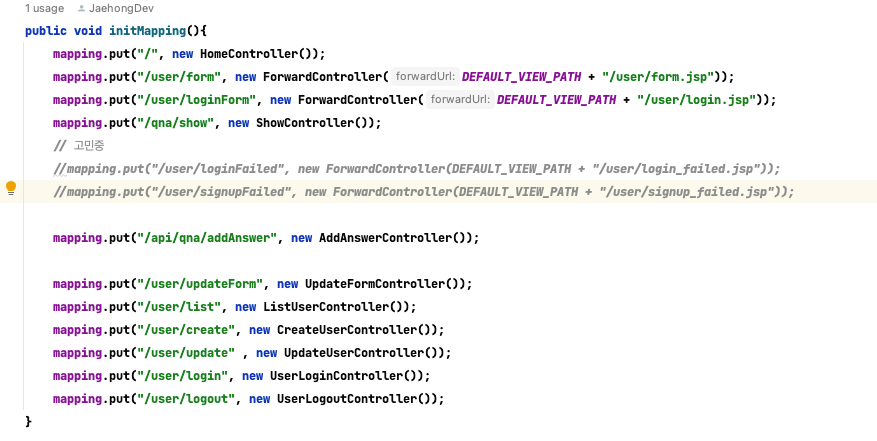
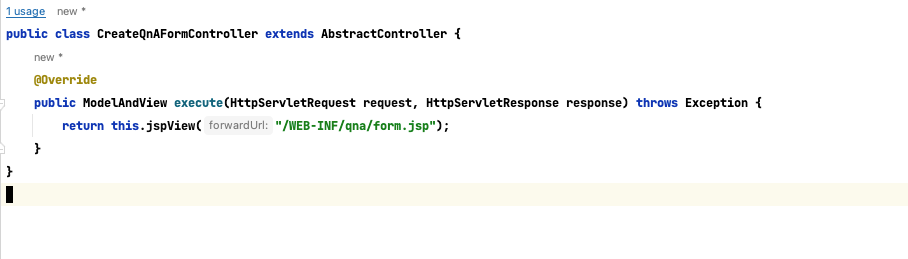
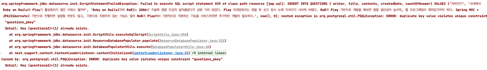
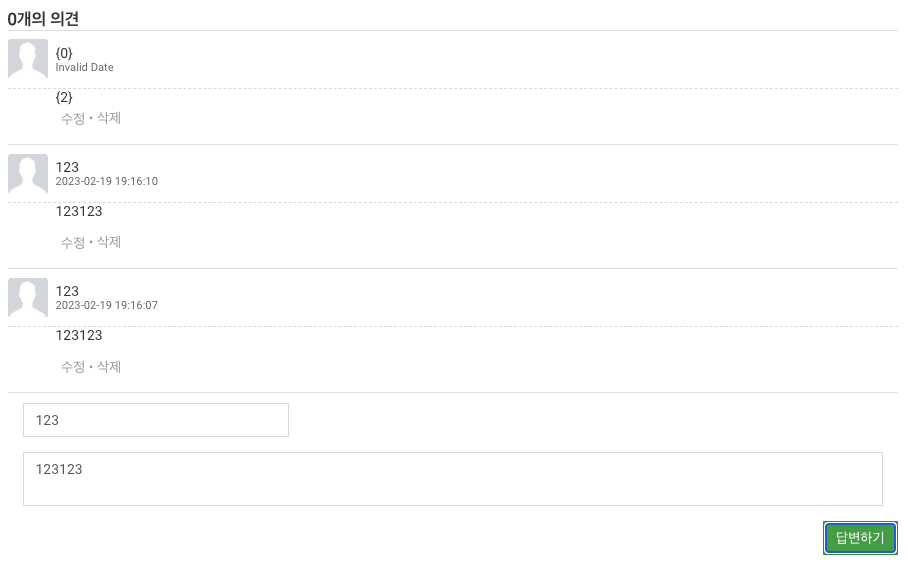
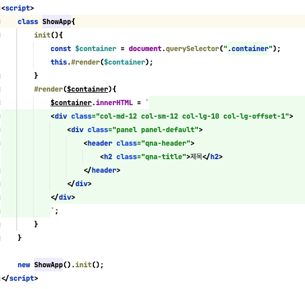

# 8장 AJAX 를 활용해 새로고침 없이 데이터 갱신하기
## 목적
- 직접 구현한 프레임워크와 라이브러리를 활용해 질문/답변 게시판을 구현
- `ajax`를 통해 답변 추가 삭제하는 기능 구현


### postgresql 적용기
auto_increment -> serial 변경
current_time -> now() 변경


### 질문기능 추가하기
7장에서 기능 구현 중에서 질문 기능이 추가되어있다. ajax를 모르는 학습자를 대상으로 기능을 구현하는 것을 권장한다. 개인적으로 어느정도 알고 있지만 학습을 통해 한번 
구현해보려고 한다.



먼저 /qna/form에 대한 url을 등록해야한다.




현재 매핑되어 있는 컨트롤러목록이다. 여기서 /qna/form에 대한 경로를 매핑을 추가해준다.


매핑을하고 다음과 같이 코드를 작성해주면 정상적으로 연결된 것을 확인할 수 있다.

```java

public class CreateQnaActionController extends AbstractController {
    private final QuestionDao questionDao = new QuestionDao();
    @Override
    public ModelAndView execute(HttpServletRequest request, HttpServletResponse response) throws Exception {

        final var question = new Question(
                request.getParameter("writer"),
                request.getParameter("title"),
                request.getParameter("contents")
        );

        questionDao.save(question);
        return this.jspView("redirect: /");
    }
}

```
다음과 같이 코드를 작성하면 질문을 등록하고 메인 뷰로 리다이렉트 시킬 수 있다.

### 문제상황1

qna를 등록하는 과정에서 다음과 같은 오류가 발생했다. 
간략하게 데이터를 입력하는 과정에서 중복된 키가 입력되어서 입력할 수 없다는 오류였다.

postgresql에서 serial은 mysql처럼 auto_increment를 지원하지 않는다. 대신 oracle의 시퀀스와 같이 채번을 통해 자동증가키를 지원하는데

만약 데이터를 생성하는 과정에서 id값을 지정해서 등록하는 경우 해당 값은 자동증가에 포함되지 않고 바로 입력된다.

즉 
```sql
# 직접입력 
INSERT INTO questions (questionid, writer, title, contents, createddate, countofanswer) VALUES (1);
# serial
INSERT INTO questions (questionid, writer, title, contents, createddate, countofanswer) VALUES ();
```
위와 같이 직접 고유 식별키에 값을 대입하는 경우 에러가 발생하지 않고 데이터가 생성됩니다. 하지만 밑에 자동키로 입력되는 경우에서 에러가 발생하는데 맨 처음 이미지와 같이
1번 키는 이미 사용중인 키로 데이터를 사용할 수 없다고 한다.

즉 serial과 같은 데이터 유형을 가진다면 데이터를 입력할떄는 키를 직접 입력할 경우 원치 않는 사이드 이펙트가 발생할 수 있다.


### 댓글기능 추가


댓글기능을 완성했지만 한가지 문제가 생겼다. 처음 등록했을때 다음과 같은 기능이 부족했는데
- 댓글의 총량이 증가했는데 개수를 가져오지 못함
- 랜더링을 할때 처음 등록한 데이터의 경우 제대로 표시하지 못함
- 질문을 추가하고 텍스트박스가 비어있지 않는 문제

하나씩 단계별로 해결해보겠습니다.



- 템플릿 포맷을 추가하는 기능
- datetime 포맷 추가


