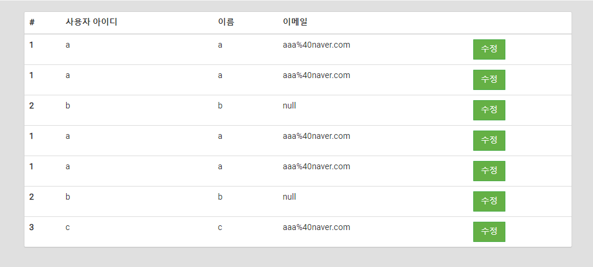

# 실습을 위한 개발 환경 세팅
* https://github.com/slipp/web-application-server 프로젝트를 자신의 계정으로 Fork한다. Github 우측 상단의 Fork 버튼을 클릭하면 자신의 계정으로 Fork된다.
* Fork한 프로젝트를 eclipse 또는 터미널에서 clone 한다.
* Fork한 프로젝트를 eclipse로 import한 후에 Maven 빌드 도구를 활용해 eclipse 프로젝트로 변환한다.(mvn eclipse:clean eclipse:eclipse)
* 빌드가 성공하면 반드시 refresh(fn + f5)를 실행해야 한다.

# 웹 서버 시작 및 테스트
* webserver.WebServer 는 사용자의 요청을 받아 RequestHandler에 작업을 위임하는 클래스이다.
* 사용자 요청에 대한 모든 처리는 RequestHandler 클래스의 run() 메서드가 담당한다.
* WebServer를 실행한 후 브라우저에서 http://localhost:8080으로 접속해 "Hello World" 메시지가 출력되는지 확인한다.

# 각 요구사항별 학습 내용 정리
* 구현 단계에서는 각 요구사항을 구현하는데 집중한다. 
* 구현을 완료한 후 구현 과정에서 새롭게 알게된 내용, 궁금한 내용을 기록한다.
* 각 요구사항을 구현하는 것이 중요한 것이 아니라 구현 과정을 통해 학습한 내용을 인식하는 것이 배움에 중요하다. 

## 3장, 4장
### 흐름
request -> RequestHandler -> (HttpInputStream -> BufferedReader -> readHttpReqeust) MyHttpRequest -> ControllerMapper -> (Controller -> Service) Response -> RequestHandler -> response  


### 요구사항 1 - http://localhost:8080/index.html로 접속시 응답
* URL: http://localhost:8080/index.html
* BufferedReader
  * .readLine() : InputStream 데이터를 라인별로 읽는다.
  * 여기서는 HTTP 요청 정보를 읽어들임
  * https://makemethink.tistory.com/170
*
          String[] tokens = lines.get(0).split(" ");
          String url = tokens[1];

          byte[] body = Files.readAllBytes(new File("./webapp" + url).toPath());

### 요구사항 2 - get 방식으로 회원가입
* 

### 요구사항 3 - post 방식으로 회원가입
* post는 본문에 데이터가 담긴다.
  * 본문과 헤더는 공백라인("")으로 구분되어있다.
* 
```java
[User [userId=hello, password=getget, name=getmy, email=get%40my.name], User [userId=asdf, password=null, name=%ED%98%84%EC%8B%9D%EB%B3%B4%EC%9D%B4, email=asdfasdf%40naver.com]]
```

### 요구사항 4 - redirect 방식으로 이동
* HTTP 302 상태 적용 후, Location: href 를 적용하지 않으니 url에 /user 가 한번 더 붙는 문제가 발생함
  * ex) /user/user/form.html
* 에러 발생
```java
Exception in thread "Thread-34" java.lang.IndexOutOfBoundsException: Index 0 out of bounds for length 0
at java.base/jdk.internal.util.Preconditions.outOfBounds(Preconditions.java:64)
at java.base/jdk.internal.util.Preconditions.outOfBoundsCheckIndex(Preconditions.java:70)
at java.base/jdk.internal.util.Preconditions.checkIndex(Preconditions.java:266)
at java.base/java.util.Objects.checkIndex(Objects.java:359)
at java.base/java.util.ArrayList.get(ArrayList.java:427)
at webserver.RequestHandler.linesToMyHttpRequest(RequestHandler.java:66)
at webserver.RequestHandler.run(RequestHandler.java:40)
```


### 요구사항 5 - cookie
* StringBuilder: https://onlyfor-me-blog.tistory.com/317
* StringBuilder Insert : https://ponyozzang.tistory.com/178

### 요구사항 6 - 유저목록
- 한 유저가 여러명 뜸 ㅠㅠ


- StringBuilder.toString()을 사용해도 builder 내부에 있는 내용이 사라지지 않으므로, 사용시 유의!
  - 아래처럼 사용해야함
```java
StringBuilder builder = new StringBuilder();
String result = "";

for(User user : users) {
    builder.append(result)
            .append("내용내용내용");
}

result = builder.toString();
```

### 요구사항 7 - stylesheet 적용
* 


## 5장
### 목표
- indent n 이하
- else 사용하지 않음
- 리팩토링

### 리팩토링 1단계
- 요청 데이터를 처리하는 로직을 별도의 클래스로 분리한다. (MyHttpRequest)
  - 클라이언트 요청 데이터를 담고있는 InputStream을 생성자로 받아 HTTP 메소드, URL, 헤더, 본문을 분리하는 작업을 한다.
  - 헤더는 Map<String, String>에 저장해 관리하고 getHeader("필드이름") 메소드를 통해 접근 가능하도록 구현한다.
  - GET과 POST 메소드에 따라 전달되는 인자를 Map<String, String>에 저장해 관리하고 getParameter("인자 이름") 메소드를 통해 접근 가능하도록 구현한다.

- POST 파라미터가 url에 위치할 수 있는가?
  - 표준은 아니지만 가능은 하다. 
    - https://stackoverflow.com/questions/6728938/is-url-parameters-okay-in-http-post-requests
  - HTML Form에 경우 parameter들이 HttpBody에 포장되어 전송됨
  - 일반 POST
```java
00:37:17.217 [DEBUG] [Thread-4] [webserver.RequestHandler] - New Client Connect! Connected IP : /127.0.0.1, Port : 10272
        00:37:17.218 [DEBUG] [Thread-4] [webserver.RequestHandler] - BufferedReader: POST /user/create HTTP/1.1
        00:37:17.218 [DEBUG] [Thread-4] [webserver.RequestHandler] - BufferedReader: Host: localhost:8080
        00:37:17.218 [DEBUG] [Thread-4] [webserver.RequestHandler] - BufferedReader: Connection: keep-alive
        00:37:17.218 [DEBUG] [Thread-4] [webserver.RequestHandler] - BufferedReader: Content-Type: application/x-www-form-urlencoded
        00:37:17.218 [DEBUG] [Thread-4] [webserver.RequestHandler] - BufferedReader: Accept: */*
00:37:17.218 [DEBUG] [Thread-4] [webserver.RequestHandler] - BufferedReader: Content-Length: 43
00:37:17.218 [DEBUG] [Thread-4] [webserver.RequestHandler] - BufferedReader: User-Agent: Apache-HttpClient/4.5.13 (Java/17.0.5)
00:37:17.218 [DEBUG] [Thread-4] [webserver.RequestHandler] - BufferedReader: Accept-Encoding: br,deflate,gzip,x-gzip
00:37:17.218 [DEBUG] [Thread-4] [webserver.RequestHandler] - RequestLine: POST /user/create HTTP/1.1
00:37:17.218 [DEBUG] [Thread-4] [webserver.RequestHandler] - Body: userId=myid&password=mypassword&name=myname
00:37:17.219 [DEBUG] [Thread-4] [webserver.RequestHandler] - request  ===========>HttpMethod:POST, requestPath:/user/create, parameters:{}, httpHeaders:{Accept=*/*, Connection=keep-alive, User-Agent=Apache-HttpClient/4.5.13 (Java/17.0.5), Host=localhost:8080, Accept-Encoding=br,deflate,gzip,x-gzip, Content-Length=43, Content-Type=application/x-www-form-urlencoded}, requestBody:userId=myid&password=mypassword&name=myname
        00:37:17.219 [DEBUG] [Thread-4] [webserver.RequestHandler] - 가입한 유저목록: [User [userId=null, password=null, name=null, email=null]]
        00:37:17.220 [DEBUG] [Thread-4] [webserver.RequestHandler] - Response => headers:[HTTP/1.1 302 Found, Location: /index.html, ], body:[B@31aa7008
        00:37:17.224 [DEBUG] [Thread-5] [webserver.RequestHandler] - New Client Connect! Connected IP : /127.0.0.1, Port : 10273
        00:37:17.224 [DEBUG] [Thread-5] [webserver.RequestHandler] - BufferedReader: GET /index.html HTTP/1.1
        00:37:17.224 [DEBUG] [Thread-5] [webserver.RequestHandler] - BufferedReader: Host: localhost:8080
        00:37:17.224 [DEBUG] [Thread-5] [webserver.RequestHandler] - BufferedReader: Connection: keep-alive
        00:37:17.224 [DEBUG] [Thread-5] [webserver.RequestHandler] - BufferedReader: Content-Type: application/x-www-form-urlencoded
        00:37:17.224 [DEBUG] [Thread-5] [webserver.RequestHandler] - BufferedReader: Accept: */*
00:37:17.224 [DEBUG] [Thread-5] [webserver.RequestHandler] - BufferedReader: User-Agent: Apache-HttpClient/4.5.13 (Java/17.0.5)
00:37:17.224 [DEBUG] [Thread-5] [webserver.RequestHandler] - BufferedReader: Accept-Encoding: br,deflate,gzip,x-gzip
00:37:17.224 [DEBUG] [Thread-5] [webserver.RequestHandler] - RequestLine: GET /index.html HTTP/1.1
00:37:17.224 [DEBUG] [Thread-5] [webserver.RequestHandler] - Body: null
00:37:17.225 [DEBUG] [Thread-5] [webserver.RequestHandler] - request  ===========>HttpMethod:GET, requestPath:/index.html, parameters:{}, httpHeaders:{Accept=*/*, Connection=keep-alive, User-Agent=Apache-HttpClient/4.5.13 (Java/17.0.5), Host=localhost:8080, Accept-Encoding=br,deflate,gzip,x-gzip, Content-Type=application/x-www-form-urlencoded}, requestBody:null
        00:37:17.226 [DEBUG] [Thread-5] [webserver.RequestHandler] - Response => headers:[HTTP/1.1 200 OK, Content-Type: text/html;charset=utf-8, Content-Length: 10500, ], body:[B@1f8ae156
```

  - POST but params in url
```java
00:36:18.965 [DEBUG] [Thread-0] [webserver.RequestHandler] - New Client Connect! Connected IP : /127.0.0.1, Port : 10262
        00:36:18.980 [DEBUG] [Thread-0] [webserver.RequestHandler] - BufferedReader: POST /user/create?userId=myid&password=mypassword&name=myname HTTP/1.1
        00:36:18.981 [DEBUG] [Thread-0] [webserver.RequestHandler] - BufferedReader: Host: localhost:8080
        00:36:18.981 [DEBUG] [Thread-0] [webserver.RequestHandler] - BufferedReader: Connection: keep-alive
        00:36:18.981 [DEBUG] [Thread-0] [webserver.RequestHandler] - BufferedReader: Content-Type: application/x-www-form-urlencoded
        00:36:18.981 [DEBUG] [Thread-0] [webserver.RequestHandler] - BufferedReader: Accept: */*
00:36:18.981 [DEBUG] [Thread-0] [webserver.RequestHandler] - BufferedReader: Content-Length: 0
00:36:18.981 [DEBUG] [Thread-0] [webserver.RequestHandler] - BufferedReader: User-Agent: Apache-HttpClient/4.5.13 (Java/17.0.5)
00:36:18.981 [DEBUG] [Thread-0] [webserver.RequestHandler] - BufferedReader: Accept-Encoding: br,deflate,gzip,x-gzip
00:36:18.981 [DEBUG] [Thread-0] [webserver.RequestHandler] - RequestLine: POST /user/create?userId=myid&password=mypassword&name=myname HTTP/1.1
00:36:18.983 [DEBUG] [Thread-0] [webserver.RequestHandler] - Body: 
00:36:19.007 [DEBUG] [Thread-0] [webserver.RequestHandler] - request  ===========>HttpMethod:POST, requestPath:/user/create, parameters:{}, httpHeaders:{Accept=*/*, Connection=keep-alive, User-Agent=Apache-HttpClient/4.5.13 (Java/17.0.5), Host=localhost:8080, Accept-Encoding=br,deflate,gzip,x-gzip, Content-Length=0, Content-Type=application/x-www-form-urlencoded}, requestBody:
        00:36:19.033 [DEBUG] [Thread-0] [webserver.RequestHandler] - 가입한 유저목록: [User [userId=null, password=null, name=null, email=null]]
        00:36:19.041 [DEBUG] [Thread-0] [webserver.RequestHandler] - Response => headers:[HTTP/1.1 302 Found, Location: /index.html, ], body:[B@77650691
        00:36:19.045 [DEBUG] [Thread-1] [webserver.RequestHandler] - New Client Connect! Connected IP : /127.0.0.1, Port : 10263
        00:36:19.046 [DEBUG] [Thread-1] [webserver.RequestHandler] - BufferedReader: GET /index.html HTTP/1.1
        00:36:19.046 [DEBUG] [Thread-1] [webserver.RequestHandler] - BufferedReader: Host: localhost:8080
        00:36:19.046 [DEBUG] [Thread-1] [webserver.RequestHandler] - BufferedReader: Connection: keep-alive
        00:36:19.046 [DEBUG] [Thread-1] [webserver.RequestHandler] - BufferedReader: Content-Type: application/x-www-form-urlencoded
        00:36:19.046 [DEBUG] [Thread-1] [webserver.RequestHandler] - BufferedReader: Accept: */*
00:36:19.046 [DEBUG] [Thread-1] [webserver.RequestHandler] - BufferedReader: User-Agent: Apache-HttpClient/4.5.13 (Java/17.0.5)
00:36:19.046 [DEBUG] [Thread-1] [webserver.RequestHandler] - BufferedReader: Accept-Encoding: br,deflate,gzip,x-gzip
00:36:19.046 [DEBUG] [Thread-1] [webserver.RequestHandler] - RequestLine: GET /index.html HTTP/1.1
00:36:19.046 [DEBUG] [Thread-1] [webserver.RequestHandler] - Body: null
00:36:19.047 [DEBUG] [Thread-1] [webserver.RequestHandler] - request  ===========>HttpMethod:GET, requestPath:/index.html, parameters:{}, httpHeaders:{Accept=*/*, Connection=keep-alive, User-Agent=Apache-HttpClient/4.5.13 (Java/17.0.5), Host=localhost:8080, Accept-Encoding=br,deflate,gzip,x-gzip, Content-Type=application/x-www-form-urlencoded}, requestBody:null
        00:36:19.051 [DEBUG] [Thread-1] [webserver.RequestHandler] - Response => headers:[HTTP/1.1 200 OK, Content-Type: text/html;charset=utf-8, Content-Length: 10500, ], body:[B@4c598bc6
```

- 응답 데이터를 처리하는 로직을 별도의 클래스로 분리한다. (HttpResponse)
  - RequestHandler 클래스를 보면 응답 데이터 처리를 위한 많은 중복이 있다. 이 중복을 제거해 본다.
  - 응답 헤더 정보를 Map<String, String>으로 관리한다.
  - 응답을 보낼 때 HTML, CSS, JS 파일을 직접 읽어 응답으로 보내는 메소드는 forward(),
  - 다른 URI로 리다이렉트하는 메소드는 sendRedirect() 메소드로 나누어 구현한다.

- 다형성을 활용해 클라이언트 요청 URL에 대한 분기 처리를 제거한다.
  - 각 요청과 응답에 대한 처리를 담당하는 부분을 추상화해 인터페이스로 만든다.
  - 각 분기문을 Controller 인터페이스를 구현하는 클래스를 만들어 분리한다.
  - 이렇게 생성한 Controller 구현체를 Map<String, Controller>에 저장한다.
    - Map의 Key에 해당하는 String은 요청 URL, value에 해당하는 Controller는 Controller 구현체이다.
  - 클라이언트 요청 URL에 해당하는 Controller를 찾아 service() 메소드를 호출한다.
  - Controller 인터페이스를 구현하는 AbstractController 추상클래스를 추가해 중복을 제거하고,
  - service() 메소드에서 GET과 POST HTTP 메소드에 따라 doGet(), doPost() 메소드를 호출하도록 한다.

## 6장
### 요구사항
- 서블릿 HttpSession API의 일부를 지원할 것
  - getId : 현제 세션에 할당되어 있는 고유한 세션 아이디를 반환
  - setAttribute : 현재 세션에 value 인자로 전달되는 객체를 name 인자 이름으로 저장
  - getAttribute : 현재 세션에 name 인자로 저장되어 있는 개체 값을 찾아 반환
  - removeAttribute : 현재 세션에 name 인자로 저장되어 있는 객체 값을 삭제
  - invalidate : 현재 세션에 저장되어 있는 모든 값을 삭제
