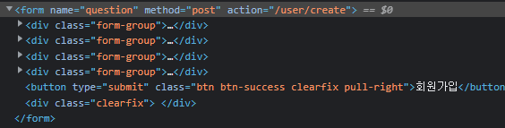

# 실습을 위한 개발 환경 세팅
* https://github.com/slipp/web-application-server 프로젝트를 자신의 계정으로 Fork한다. Github 우측 상단의 Fork 버튼을 클릭하면 자신의 계정으로 Fork된다.
* Fork한 프로젝트를 eclipse 또는 터미널에서 clone 한다.
* Fork한 프로젝트를 eclipse로 import한 후에 Maven 빌드 도구를 활용해 eclipse 프로젝트로 변환한다.(mvn eclipse:clean eclipse:eclipse)
* 빌드가 성공하면 반드시 refresh(fn + f5)를 실행해야 한다.

# 웹 서버 시작 및 테스트
* webserver.WebServer 는 사용자의 요청을 받아 RequestHandler에 작업을 위임하는 클래스이다.
* 사용자 요청에 대한 모든 처리는 RequestHandler 클래스의 run() 메서드가 담당한다.
* WebServer를 실행한 후 브라우저에서 http://localhost:8080으로 접속해 "Hello World" 메시지가 출력되는지 확인한다.

# 각 요구사항별 학습 내용 정리
* 구현 단계에서는 각 요구사항을 구현하는데 집중한다. 
* 구현을 완료한 후 구현 과정에서 새롭게 알게된 내용, 궁금한 내용을 기록한다.
* 각 요구사항을 구현하는 것이 중요한 것이 아니라 구현 과정을 통해 학습한 내용을 인식하는 것이 배움에 중요하다. 

### 요구사항 1 - http://localhost:8080/index.html로 접속시 응답
* URL: http://localhost:8080/index.html
* BufferedReader
  * .readLine() : InputStream 데이터를 라인별로 읽는다.
  * 여기서는 HTTP 요청 정보를 읽어들임
  * https://makemethink.tistory.com/170
*
          String[] tokens = lines.get(0).split(" ");
          String url = tokens[1];

          byte[] body = Files.readAllBytes(new File("./webapp" + url).toPath());

### 요구사항 2 - get 방식으로 회원가입
* 

### 요구사항 3 - post 방식으로 회원가입
* post는 본문에 데이터가 담긴다.
  * 본문과 헤더는 공백라인("")으로 구분되어있다.
* 
```java
[User [userId=hello, password=getget, name=getmy, email=get%40my.name], User [userId=asdf, password=null, name=%ED%98%84%EC%8B%9D%EB%B3%B4%EC%9D%B4, email=asdfasdf%40naver.com]]
```

### 요구사항 4 - redirect 방식으로 이동
* HTTP 302 상태 적용 후, Location: href 를 적용하지 않으니 url에 /user 가 한번 더 붙는 문제가 발생함
  * ex) /user/user/form.html
* 에러 발생
```java
Exception in thread "Thread-34" java.lang.IndexOutOfBoundsException: Index 0 out of bounds for length 0
at java.base/jdk.internal.util.Preconditions.outOfBounds(Preconditions.java:64)
at java.base/jdk.internal.util.Preconditions.outOfBoundsCheckIndex(Preconditions.java:70)
at java.base/jdk.internal.util.Preconditions.checkIndex(Preconditions.java:266)
at java.base/java.util.Objects.checkIndex(Objects.java:359)
at java.base/java.util.ArrayList.get(ArrayList.java:427)
at webserver.RequestHandler.linesToMyHttpRequest(RequestHandler.java:66)
at webserver.RequestHandler.run(RequestHandler.java:40)
```


### 요구사항 5 - cookie
* StringBuilder: https://onlyfor-me-blog.tistory.com/317
* StringBuilder Insert : https://ponyozzang.tistory.com/178

### 요구사항 6 - stylesheet 적용
* 

### heroku 서버에 배포 후
* 